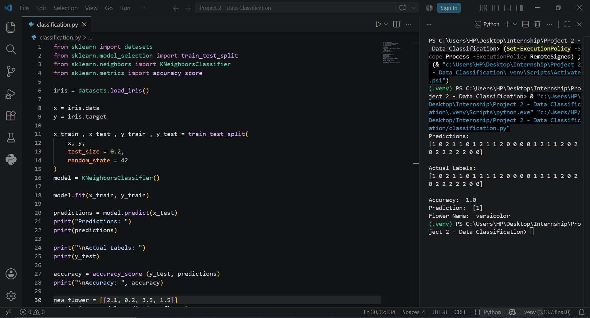

# 🌸 Project 2 - Data Classification Using AI

## 📌 Project Overview

This project is a basic Machine Learning classification model developed using **Python** and **Scikit-learn** as part of the **DecodeLabs AI Internship**.

The model uses the famous **Iris Dataset** to classify flowers into three different species based on their measurements. It demonstrates the complete supervised learning workflow, including data loading, model training, prediction, and performance evaluation.

---

## 🎯 Project Goal

Build a basic AI classification model that can:

- Load and understand a dataset
- Split data into training and testing sets
- Train a Machine Learning model
- Predict the class of unseen data
- Evaluate model accuracy

---

## ✨ Features

- 📊 Load the Iris dataset
- 🔍 Understand features and labels
- ✂️ Split data into training and testing sets
- 🤖 Train a K-Nearest Neighbors (KNN) classifier
- 📈 Make predictions on test data
- ✅ Calculate model accuracy
- 🌸 Predict the species of a new flower using custom input

---

## 🛠️ Technologies Used

- Python 3
- Scikit-learn
- VS Code

---

## 📂 Dataset

The project uses the built-in **Iris Dataset** provided by Scikit-learn.

The dataset contains:

- 150 flower samples
- 4 numerical features:
  - Sepal Length
  - Sepal Width
  - Petal Length
  - Petal Width
- 3 flower classes:
  - Setosa
  - Versicolor
  - Virginica

---

## 🚀 How to Run

### 1. Clone the repository

```bash
git clone https://github.com/Muhaz-Shehzad/Project-2-Data-Classification.git
```

### 2. Navigate into the project

```bash
cd Project-2-Data-Classification
```

### 3. Install dependencies

```bash
pip install -r requirements.txt
```

### 4. Run the project

```bash
python classification.py
```

---

## 📸 Project Screenshot



---

## 📈 Sample Output

```
Predictions:
[1 0 2 1 1 ...]

Actual Labels:
[1 0 2 1 1 ...]

Accuracy:
1.0

Prediction:
[1]

Flower Name:
versicolor
```

---

## 📚 Learning Outcomes

Through this project, I learned:

- Data handling in Machine Learning
- Features and labels
- Supervised learning basics
- Training and testing datasets
- K-Nearest Neighbors (KNN) algorithm
- Model training
- Making predictions
- Evaluating model accuracy

---

## 🎓 Internship

This project was completed as **Project 2** during the **DecodeLabs AI Internship**.

---

## 👨‍💻 Author

**Muhaz Shehzad**
